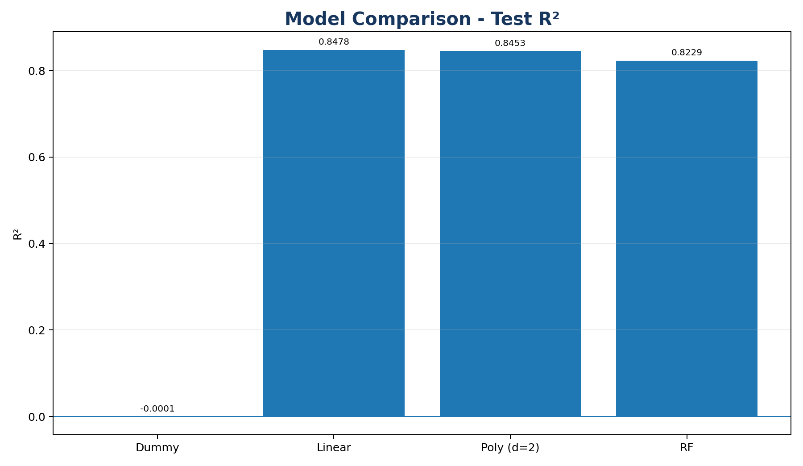
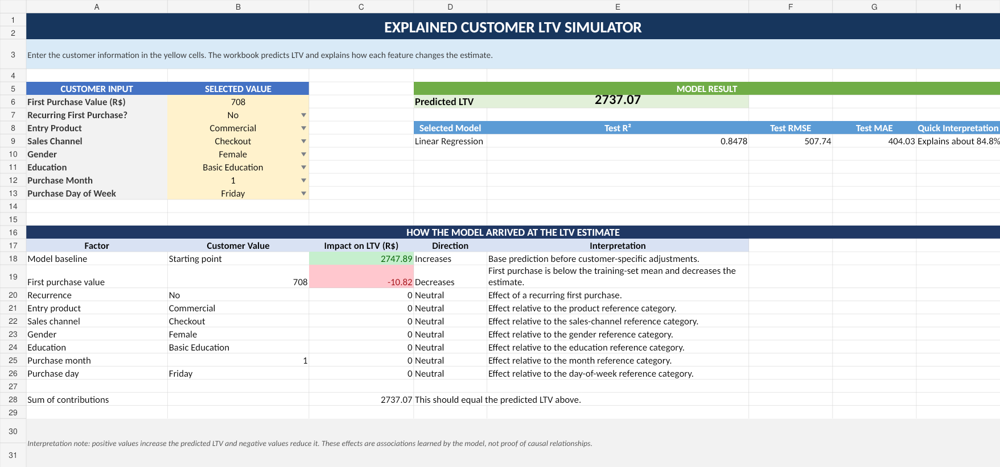
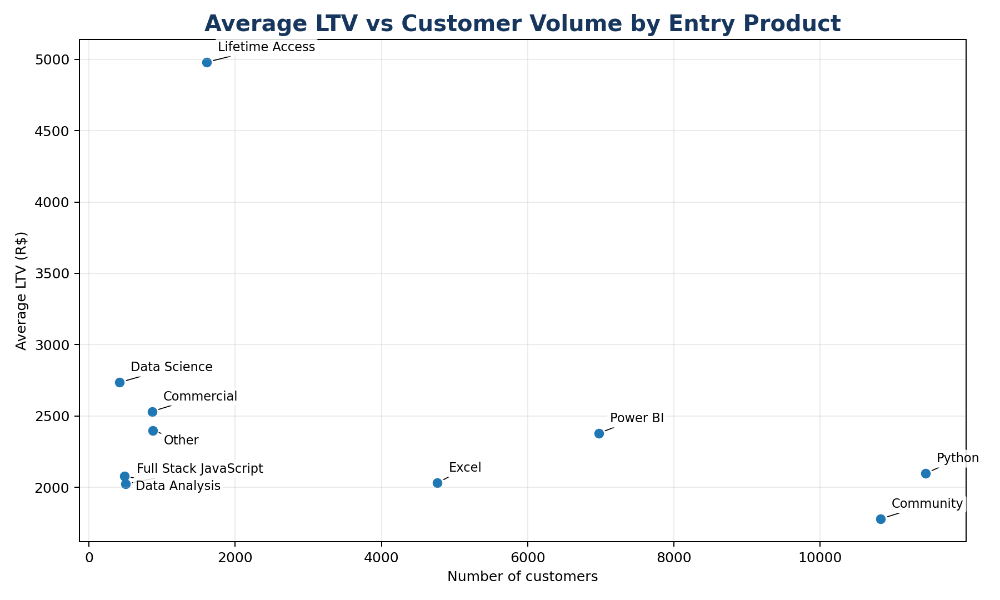

# Customer Lifetime Value Prediction | CRISP-DM

End-to-end **Customer Lifetime Value (LTV)** regression project developed with the **CRISP-DM methodology**, covering business understanding, data preparation, model comparison, cross-validation, evaluation, and deployment through an interactive **Streamlit application** and Excel-based business tools.

> **Portfolio note:** This repository contains my own code, analysis, write-up, and deployment artifacts created from an educational case study. The original course material and the original full dataset are not redistributed.

## 🚀 Live Demo

**Try the interactive Customer LTV Simulator:**

[Open the Streamlit app](https://julianocramos-ltv-simulator.streamlit.app)

The web application allows users to enter first-purchase customer characteristics and receive an immediate LTV prediction from the selected Linear Regression model.

It also displays:

- predicted Customer Lifetime Value
- model test performance
- feature-level contribution to the prediction
- direction of each contribution
- reference-category interpretation

The application uses the fitted parameters of the selected model, allowing the deployment demo to run without redistributing the original educational dataset.

## Project objective

The business goal is to estimate, **at the moment of the first purchase**, how much value a customer is expected to generate over time.

A reliable LTV estimate can support:

- acquisition-budget allocation
- product and channel prioritization
- customer segmentation
- maximum acceptable CAC decisions
- retention and cross-sell strategies

Because **LTV is a continuous monetary target**, this is a **supervised regression** problem.

## Results at a glance

- **Customers analyzed:** 38,753
- **Historical LTV represented in the prepared dataset:** R$ 84,964,816.22
- **Train/test split:** 80/20 (`random_state=42`)
- **Cross-validation:** 5-fold K-Fold on the training set
- **Validation metric:** R²
- **Final transformed feature space:** 41 features
- **Selected model:** Linear Regression
- **Test R²:** 0.8478
- **Test RMSE:** R$ 507.74
- **Test MAE:** R$ 404.03

## CRISP-DM workflow

### 1. Business Understanding

The model must estimate expected LTV using **only information available at the first purchase**.

This avoids future-information leakage and keeps the prediction useful for real acquisition decisions.

### 2. Data Understanding

The prepared modeling dataset contains **38,753 customers**.

The features used for modeling are:

- first purchase value
- whether the first purchase is recurring
- entry product
- sales channel
- gender
- education
- purchase month
- purchase day of week

The original prepared dataset uses Portuguese field names and category labels. The pipeline automatically translates the source schema into English before modeling.

### 3. Data Preparation

After the source schema is translated:

- Target: `LTV`
- `StandardScaler`: `first_purchase_value`
- `OneHotEncoder(drop="first", handle_unknown="ignore")`: categorical features
- `recurring_first_purchase`: passed through unchanged
- `purchase_month`: treated as categorical
- Train/test split: **80/20**, `random_state=42`
- All preprocessing remains **inside the Scikit-learn Pipeline**
- Final transformed training matrix: **41 features**

### 4. Modeling

Four regression approaches were compared with **5-fold cross-validation on the training set**, using **R²**.

| Model | Fold 1 | Fold 2 | Fold 3 | Fold 4 | Fold 5 | Mean R² |
|---|---:|---:|---:|---:|---:|---:|
| Dummy | -0.0001 | -0.0026 | -0.0011 | -0.0000 | -0.0004 | -0.0009 |
| **Linear** | **0.8489** | **0.8440** | **0.8533** | **0.8486** | **0.8572** | **0.8504** |
| Poly (d=2) | 0.8434 | 0.8399 | 0.8501 | 0.8455 | 0.8533 | 0.8464 |
| RF | 0.8210 | 0.8152 | 0.8313 | 0.8254 | 0.8339 | 0.8254 |

### 5. Evaluation

**Linear Regression** was selected because it achieved the strongest cross-validation performance while remaining highly interpretable.

| Metric | Test result |
|---|---:|
| **R²** | **0.8478** |
| **RMSE** | **R$ 507.74** |
| **MAE** | **R$ 404.03** |

The MAE means that individual predictions differ from historical LTV by about **R$ 404 on average in absolute terms**.

The model should therefore be used as a **decision-support estimate**, not as a guaranteed future customer value.



### 6. Deployment

The selected Linear Regression model was deployed in two complementary formats.

#### Interactive web application

The Streamlit application provides a browser-based interface for scoring individual customer profiles.

[Launch the Customer LTV Simulator](https://julianocramos-ltv-simulator.streamlit.app)

Users can provide:

- first purchase value
- recurring status
- entry product
- sales channel
- gender
- education
- purchase month
- purchase day of week

The app immediately returns the predicted LTV together with the test metrics and a breakdown of each feature's contribution to the estimate.

The Streamlit deployment uses the fitted parameters of the selected final model and therefore does not require the original dataset at runtime.

#### Excel business tools

Two Excel deployment artifacts are also included:

- [`deploy/ltv_explained_simulator.xlsx`](deploy/ltv_explained_simulator.xlsx): single-customer simulator showing the predicted LTV and the contribution of each feature.
- [`deploy/ltv_operational_batch.xlsx`](deploy/ltv_operational_batch.xlsx): operational table for scoring multiple new customers.

Both spreadsheets accept the first purchase value directly in **Brazilian reais (R$)**.



## Business insight: LTV must be interpreted together with customer volume

Average LTV alone can be misleading when segment sizes are very different.

| Entry product | Customers | Average LTV | Total historical LTV |
|---|---:|---:|---:|
| Python | 11,444 | R$ 2,097.22 | **R$ 24.00M** |
| Community | 10,827 | R$ 1,778.27 | **R$ 19.25M** |
| Power BI | 6,971 | R$ 2,378.33 | **R$ 16.58M** |
| Excel | 4,767 | R$ 2,030.97 | R$ 9.68M |
| Lifetime Access | 1,610 | **R$ 4,980.48** | R$ 8.02M |

**Lifetime Access** has the highest value per customer, while **Python** produces the largest total historical LTV because of its scale.



This distinction is important for acquisition strategy: the most valuable customer segment is not necessarily the segment that contributes the most total economic value.

## Case discussion

The case discussion is summarized in:

- [`reports/case_questions_and_answers.md`](reports/case_questions_and_answers.md)
- [`reports/ltv_case_report.pdf`](reports/ltv_case_report.pdf)

## Repository structure

```text
customer-lifetime-value-crispdm/
│
├── data/
│   ├── README.md
│   └── sample_input_template.csv
│
├── notebooks/
│   └── 01_ltv_crisp_dm.ipynb
│
├── src/
│   └── ltv_pipeline.py
│
├── reports/
│   ├── case_questions_and_answers.md
│   └── ltv_case_report.pdf
│
├── deploy/
│   ├── ltv_explained_simulator.xlsx
│   └── ltv_operational_batch.xlsx
│
├── images/
│   ├── ltv_vs_volume_product.png
│   ├── model_comparison.png
│   └── ltv_simulator_preview.png
│
├── app.py
├── README.md
├── requirements.txt
├── .gitattributes
├── .gitignore
└── LICENSE